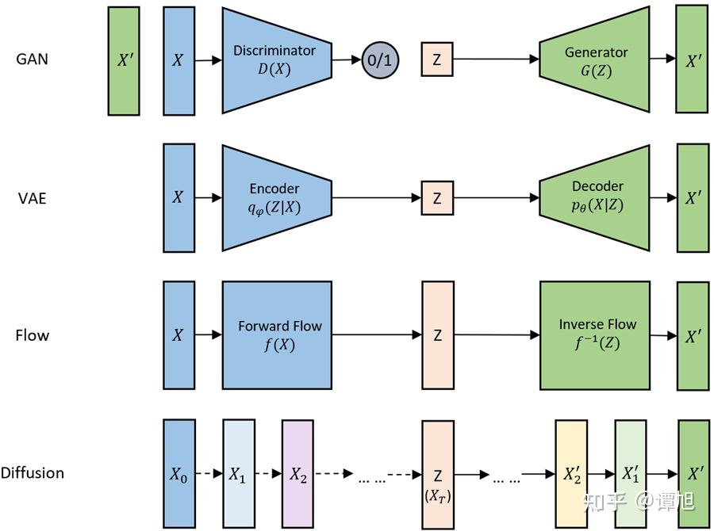

# MNIST手写数字生成

> 本文全部代码位于[GitHub仓库](https://github.com/ji2814/hello-MNIST)中的Generate目录中

在上文中我们了解到，MNIST数据集作为深度学习领域中的`hello,wolrd!`​有着其独特的魅力，也简要介绍并实现了判别式任务的模型来完成手写数字识别。手写数字识别有着很广阔的使用范围，而近年来AIGC的蓬勃发展也让我对于深度学习中的生成式任务充满好奇。

生成式任务是指那些需要模型生成新的数据或者预测未来数据的任务。例如，文本生成、图像生成、音频生成等。在这类任务中，模型试图学习数据的联合概率分布，从而能够生成与原始数据类似的新数据。生成式任务通常使用生成模型，如生成对抗网络（GANs）、变分自编码器（VAEs）、去噪扩散模型 (Diffusion)等，从随机噪声中生成我们所需要的数据（图片、声音、甚至视频）。更复杂一些，模型还可以结合输入条件来生成特定的数据，由此引申出相对应的条件生成对抗网络（cGANs）、条件扩散模型（cDIffusion）等。​

在本文中，我们依旧是利用MNIST数据集来进行模型训练。我们实现了生成对抗模型GAN、引入深度神经网络的DCGAN、引入条件的cGAN和降噪扩散Diffusion模型来作为生成式模型，以此来解开生成式AI的神秘面纱。
