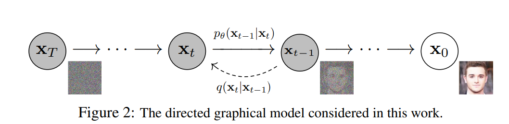
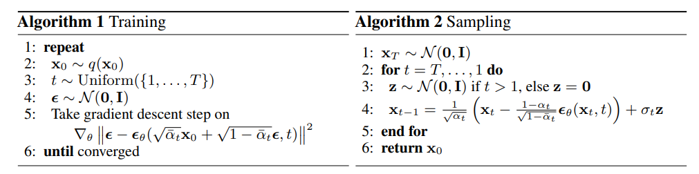
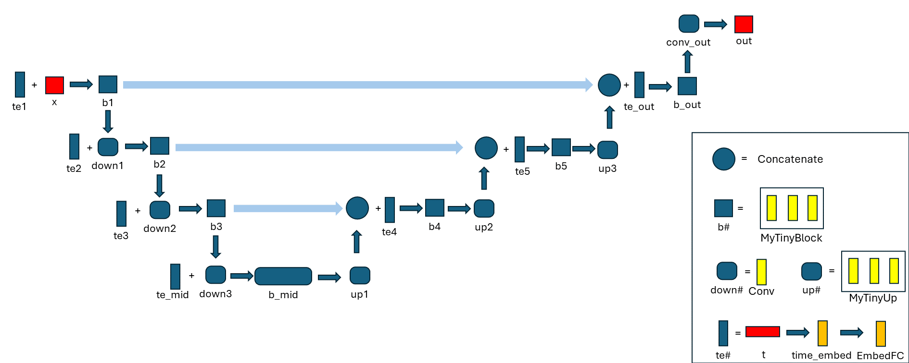
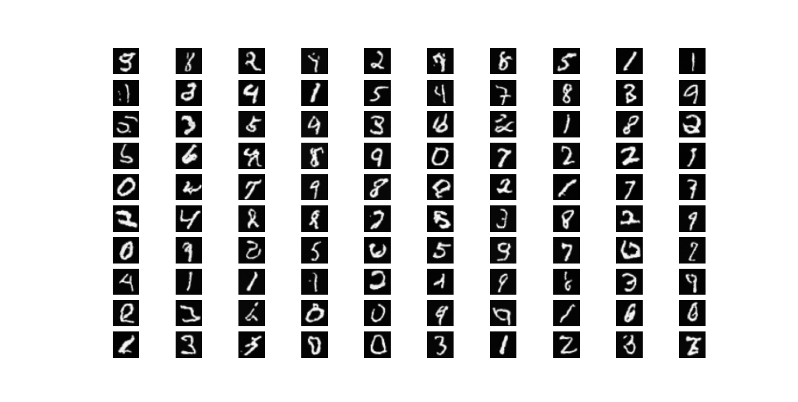

# Diffusion

# Diffusion模型

要说到生成式模型，就不得不提起最近大火的[stable diffusion](https://github.com/CompVis/stable-diffusion)软件，无数大佬用这个软件生成很多有意思的图片。我其背后的diffusion模型也挺好奇。据了解，diffusion模型用于在深度学习和人工智能领域生成高质量、逼真的数据，特别是在图像生成方面表现出色。它的基本思想是首先生成一个随机的噪声数据，然后逐步将这个噪声转化为有意义的数据（如图像）。与GAN架构不同的是，Diffusion模型只需要训练一个**降噪模型**就可以生成图像，从而具有更高的稳定性的可训练性。

Diffusion模型的工作流程可以分为两个阶段：

* 正向扩散过程：在这个阶段，模型逐渐地将真实数据（如一张图片）添加噪声，直至完全转化为噪声。

* 逆向降噪过程：在逆向过程中，模型从纯噪声状态开始，利用神经网络逐步去除噪声，恢复成有结构的数据（如生成一张图片）。

下面是从[Diffusion论文](https://arxiv.org/abs/2006.11239)上截的一张示意图，可以清楚看出Diffusion模型的原理。需要注意的是，本文仅仅是简单的实现了Diffusion模型用于MNIST数据集的训练，真正的Diffusion模型要更加复杂和健壮。

​​

# 训练过程

Diffusion模型的训练过程主要包括以下几个步骤

* **数据准备**：采用MNIST手写数字数据集，将28x28的图像上采样到32x32大小以适应神经网络的输入，并进行像素数据标准化，使得均值和方差都为0.5，这有助于提高训练的稳定性。
* **正向扩散**：对每张真实图片逐渐添加高斯噪声。这通常是通过一系列连续的时间步（t=1,2,3…,T，t=0时为原图）来完成的，在每个时间步上，向上一步得到的图片添加**不同强度**的高斯噪声。随着t的增加，噪声强度逐渐增大，图像的细节逐渐被噪声掩盖，直到在时间步T时，图像几乎完全被随机噪声覆盖。但实际上，对于”逐步添加不同强度的噪声”这件事是一步进行的。
* **准备神经网络模型**：准备一个神经网络模型（如UNet结构）用于从带有噪声的图像中预测出噪声。模型的输入是带有噪声的图像，输出是预测的噪声。模型的训练目标是学习在给定噪声图像的情况下预测出噪声的能力。
* **逆向降噪**：在训练过程中，给定一张与原图大小一致的随机噪声，将其输入到神经网络模型中。模型会生成一个预测噪声图，然后用原始噪声图**减去**预测噪声图，得出降噪后的图像。然后将减噪后的图像再次输入到神经网络中，重复上述步骤，使其逐步逼近原始图像数据，同时我们还会添加弱噪声来保证模型的稳定性。最后从带有噪声的图像中恢复出原始图像。

训练结束后，我们所定义的神经网络模型就能拥有随机噪声中一步一步生成图像的能力。

## 导包、定义超参和加载MNIST数据集

```python
import os, sys
import torch
import torch.nn as nn
import torchvision

from models.difusion.UNet import MyTinyUNet
from models.difusion.Diffusion import DDPM

#定义超参数
device = torch.device('cuda:0' if torch.cuda.is_available() else 'cpu')

lr = 1e-3
num_epochs = 50
num_timesteps = 1000

batch_size = 64

# 加载MNIST数据集
transform = torchvision.transforms.Compose([
        torchvision.transforms.Resize(32),
        torchvision.transforms.ToTensor(),
        torchvision.transforms.Normalize((0.5), (0.5))
    ])
train_dataset = torchvision.datasets.MNIST(root='./data', train=True, transform=transform, download=True)
# 定义数据加载器
train_loader = torch.utils.data.DataLoader(dataset=train_dataset, batch_size=batch_size, shuffle=True, drop_last = True)
```

## 定义神经网络和DIffusion模型

```python
# 定义模型
network = MyTinyUNet()
network = network.to(device)
model = DDPM(network, num_timesteps, beta_start=0.0001, beta_end=0.02, device=device)

# 损失函数使用MSELoss
# 优化器用Adam
criterion = nn.MSELoss()

optimizer = torch.optim.Adam(network.parameters(), lr=lr)
```

## 训练并保存模型

我们首先生成噪声`noise`​和随机时间步`timesteps`​(从0到num_timesteps)，之后执行正向扩散过程得到最终接近完全噪声的`noisy`​，在之后执行逆向降噪过程，使用梯度下降法来训练神经网络模型。

```python
# 训练过程
print(device)
for epoch in range(num_epochs):
    for i, (images, labels) in enumerate(train_loader):
        images = images.to(device)
        noise = torch.randn(images.shape).to(device)
        timesteps = torch.randint(0, num_timesteps, (images.shape[0],)).long().to(device)

        noisy = model.add_noise(images, noise, timesteps) # 正向扩散
        noise_pred = model.reverse(noisy, timesteps) # 逆向降噪

        loss = criterion(noise_pred, noise)

        optimizer.zero_grad()
        loss.backward()
        optimizer.step()
  
        # 打印loss
        if (i+1) % 100 == 0:
            print('Epoch [{}/{}], Step [{}/{}], Loss: {:.4f}'.format(epoch+1, 
                    num_epochs, i+1, len(train_loader), loss.detach().item()))

# 保存模型
current_dir = os.path.join(os.path.dirname(os.path.abspath(__file__)), 'save') + os.sep
torch.save(network.state_dict(), current_dir + 'unet.pth')
```

# 测试过程

使用测试程序生成100张图片

## 导包

```python
import os, sys
import torch
import torch.nn as nn
import torchvision

from models.difusion.UNet import MyTinyUNet
from models.difusion.Diffusion import DDPM
```

## 定义超参数

```python
# 定义超参数
device = torch.device('cuda:0' if torch.cuda.is_available() else 'cpu')

learning_rate = 1e-3
num_epochs = 50
num_timesteps = 1000
```

## 定义模型和加载参数

```python
# 定义模型
network = MyTinyUNet()
network = network.to(device)
model = DDPM(network, num_timesteps, beta_start=0.0001, beta_end=0.02, device=device)

# 加载模型参数
network.eval()
model_dir = os.path.join(os.path.dirname(os.path.abspath(__file__)), 'save', 'unet.pth')
network.load_state_dict(torch.load(model_dir)) 
```

## 生成图像

```python
# 生成图像
frames = []  

ddpm.eval()  
with torch.no_grad():  
    timesteps = list(range(ddpm.num_timesteps))[::-1]  
    sample = torch.randn(100, 1, 32, 32).to(device)  
    
    for t in timesteps:  
        time_tensor = (torch.ones(100,1) * t).long().to(device)  
        residual = ddpm.reverse(sample, time_tensor)  
        sample = ddpm.step(residual, time_tensor[0], sample)  

    for i in range(100):  
        frames.append(sample[i].detach().cpu())  

```

## 画出图像

```python
# 画出图像
images = [im.permute(1,2,0).numpy() for im in frames]

fig = plt.figure(figsize=(8, 8))
rows = int(len(images) ** (1 / 2))
cols = round(len(images) / rows)

idx = 0
for r in range(rows):
    for c in range(cols):
        fig.add_subplot(rows, cols, idx + 1)

        if idx < len(images):
            plt.imshow(images[idx], cmap="gray")
            plt.axis('off')
            idx += 1

plt.show()
```

# 模型实例

## DDPM

DDPM（Denoising Diffusion Probabilistic Models，去噪扩散概率模型），该类我们实现了三个方法`add_noise`​、`reverse`​、`step`​分别对应正向扩散、逆向降噪和采样过程。下图是Diffusion原始论文中的训练和采样过程​

* ​ **​`__init__`​** ​：类的初始化方法。传入用来降噪的神经网络`network`​，时间步总数`num_timesteps`​和计算所用设备`device`​并存储起来。使用 `torch.linspace`​ 函数生成一个从 `beta_start`​ 到 `beta_end`​ 共有 `num_timesteps`​ 个点的等差数列，并将结果存储在 `self.betas`​ 中。这个数列代表了在每个时间步中添加到数据中的噪声的方差。`alphas`​与`betas`​是相对的，表示在每个时间步中保留的原始数据信息的比例（即1减去噪声的比例）。之后使用 `torch.cumprod`​ 函数计算 `alphas`​ 的累积乘积并存储在 `self.alphas_cumprod`​ 中。这表示从第一个时间步到当前时间步保留的原始数据信息的累积比例。最后计算 `alphas_cumprod`​ 的平方根和`1 - alphas_cumprod`​ 的平方根分别存储。
* ​**​`add_noise`​**​：正向扩散过程。虽说原始论文中展现的正向扩散过程是按照一步步逐渐加噪最终得到一个完全噪声的，但其实在实现过程中这个步骤是**一步完成**的。`add_noise`​方法输入初始数据`x_start`​、与原图大小一致噪声`noise`​和时间步序列`timesteps`​，最终返回时间步T加噪后的数据。具体来说，方法从 `self.sqrt_alphas_cumprod`​ 和 `self.sqrt_one_minus_alphas_cumprod`​ 中根据 `timesteps`​ 索引获取对应的值，这些值表示在每个时间步中保留的原始数据和添加的噪声的比例的平方根。之后通过pytorch的广播机制使张量维度匹配并进行逐元素的运算。最终通过`s1 * x_start + s2 * x_noise`​这行代码计算出的 `s1`​ 和 `s2`​ 对 `x_start`​ 和 `x_noise`​ 进行加权求和，得到扩散后的数据。
* ​**​`reverse`​**​：逆向降噪过程。只有一行代码，就是将噪声`x`​和时间步`t`​通过神经网络（UNet）来预测噪声，也是我们在训练时的优化目标。
* ​**​`step`​**​：采样过程。这个过程输入从UNet模型的预测值`model_output`​、当前时间步`time_step`​和前一个时间步的预测样本（或初始噪声）`sample`​，返回的是预测的上一个时间步的样本。首先，该函数计算了相关的系数来从模型中恢复数据，之后使用系数来从当前`sample`​和`model_output`​预测上一个时间步样本。并在必要时（`t>0`​）添加噪声确保反向降噪时样本的方差逐渐减少从而恢复至原始数据，最后返回结果（对应上图中的`z`​）。

```python
import torch
import torch.nn as nn

class DDPM(nn.Module):
    # 初始化方法
    def __init__(self, network, num_timesteps, beta_start=0.0001, beta_end=0.02, device=None) -> None:
        super(DDPM, self).__init__()

        self.device = device

        self.num_timesteps = num_timesteps
        self.betas = torch.linspace(beta_start, beta_end, num_timesteps, dtype=torch.float32).to(self.device)
        self.alphas = 1.0 - self.betas
        self.alphas_cumprod = torch.cumprod(self.alphas, axis=0) # 累乘
        self.network = network
        self.sqrt_alphas_cumprod = self.alphas_cumprod ** 0.5 
        self.sqrt_one_minus_alphas_cumprod = (1 - self.alphas_cumprod) ** 0.5 

    def add_noise(self, x_start, x_noise, timesteps):
        # 正向扩散
        # x_start and x_noise (bs, n_c, w, h)
        # timesteps (bs)
        s1 = self.sqrt_alphas_cumprod[timesteps] # bs
        s2 = self.sqrt_one_minus_alphas_cumprod[timesteps] # bs
        s1 = s1.reshape(-1,1,1,1) # (bs, 1, 1, 1) for broadcasting
        s2 = s2.reshape(-1,1,1,1) # (bs, 1, 1, 1)
        return s1 * x_start + s2 * x_noise

    def reverse(self, x, t):
        # 逆向降噪
        return self.network(x, t)
  
    def step(self, model_output, timestep, sample):
        # 采样
        # timestep (1)
        t = timestep
        coef_epsilon = (1-self.alphas)/self.sqrt_one_minus_alphas_cumprod
        coef_eps_t = coef_epsilon[t].reshape(-1,1,1,1)
        coef_first = 1/self.alphas ** 0.5
        coef_first_t = coef_first[t].reshape(-1,1,1,1)
        pred_prev_sample = coef_first_t*(sample-coef_eps_t*model_output)

        variance = 0
        if t > 0:
            noise = torch.randn_like(model_output).to(self.device).to(self.device)
            variance = ((self.betas[t] ** 0.5) * noise)
          
        pred_prev_sample = pred_prev_sample + variance

        return pred_prev_sample
  
```

## UNet

在逆向降噪过程中我们使用神经网络来预测添加到图像上的噪声。神经网络选用U型结构的UNet网络。在这里只是简单实现了一个小型的TinyUNet网络，结构如下图所示​

时间步t首先通入嵌入层将其向量化，之后进入位置编码（因为正向扩散是一步完成的，所以需要考虑不同时间步的位置），最后通过由两层全连接层和`SiLU`​激活函数组成的嵌入层`EmbedFC`​获得时间步的嵌入向量。而图像与时间步嵌入向量相加后，利用卷积进行特征抽取和下采样，并且在上采样的过程中考虑使用残差连接以防止梯度爆炸或者梯度消失问题。

位置编码函数使用正弦位置编码

```python
def sinusoidal_embedding(n, d):
    # 位置编码
    embedding = torch.tensor([[i / 10_000 ** (2 * j / d) for j in range(d)] for i in range(n)])
    sin_mask = torch.arange(0, n, 2)

    embedding[sin_mask] = torch.sin(embedding[sin_mask])
    embedding[1 - sin_mask] = torch.cos(embedding[sin_mask])

    return embedding
```

卷积模块包括卷积层，可选的`LN`​层和`SiLU`​激活函数层

```python
class MyConv(nn.Module):
    # 卷积模块 
    def __init__(self, in_c, out_c, kernel_size=3, stride=1, padding=1, activation=None, normalize=True):  
        super(MyConv, self).__init__()  

        self.conv1 = nn.Conv2d(in_c, out_c, kernel_size, stride, padding)  
        self.ln = nn.LayerNorm([out_c]) if normalize else None  # 只有在normalize为True时才添加LayerNorm  
        self.activation = nn.SiLU() if activation is None else activation  
  
    def forward(self, x):  
        out = self.conv1(x)  
        if self.ln is not None: 
            out = out.permute(0, 2, 3, 1) # (bs, c, h, w)->(bs, h, w, c)
            out = self.ln(out) 
            out = out.permute(0, 3, 2, 1) # 变换回来
        if self.activation is not None:  
            out = self.activation(out)  

        return out
```

Block块使用三层卷积模块抽取特征

```python
def MyTinyBlock(in_c, out_c, size=None, normalize=True):  
    return nn.Sequential(  
        MyConv(in_c, out_c, normalize=normalize),  # 第一个卷积层  
        MyConv(out_c, out_c, normalize=normalize),  # 第二个卷积层  
        MyConv(out_c, out_c, normalize=normalize)   # 第三个卷积层  
    )  
```

上采样模块利用三层卷积，期间不断地减半通道数

```python
def MyTinyUp(in_c, normalize=True):
    # 上采样
    return nn.Sequential(  
        MyConv(in_c, in_c//2, normalize=normalize),  # 第一个卷积层，通道数减半  
        MyConv(in_c//2, in_c//4, normalize=normalize),  # 第二个卷积层，通道数再减半  
        MyConv(in_c//4, in_c//4, normalize=normalize)  # 第三个卷积层，保持通道数不变  
    )  
```

之后就是完整的UNet网络定义，与上图展示的一致

```python
class MyTinyUNet(nn.Module):
  # UNet网络
  # 三层上采样和三层下采样部分
    def __init__(self, in_c=1, out_c=1, size=32, n_steps=1000, time_emb_dim=100):
        super(MyTinyUNet, self).__init__()

        # 时间序列位置编码
        self.time_embed = nn.Embedding(n_steps, time_emb_dim)
        self.time_embed.weight.data = sinusoidal_embedding(n_steps, time_emb_dim)
        self.time_embed.requires_grad_(False)

        # 左半部分
        self.te1 = self.EmbedFC(time_emb_dim, 1)
        self.b1 = MyTinyBlock(in_c=in_c, out_c=10)
        self.down1 = nn.Conv2d(in_channels=10, out_channels=10, kernel_size=4, stride=2, padding=1)
        self.te2 = self.EmbedFC(time_emb_dim, 10)
        self.b2 = MyTinyBlock(in_c=10, out_c=20)
        self.down2 = nn.Conv2d(20, 20, 4, 2, 1)
        self.te3 = self.EmbedFC(time_emb_dim, 20)
        self.b3 = MyTinyBlock(20, 40)
        self.down3 = nn.Conv2d(40, 40, 4, 2, 1)

        # 底层
        self.te_mid = self.EmbedFC(time_emb_dim, 40)
        self.b_mid = nn.Sequential(
            MyConv(40, 20),
            MyConv(20, 20),
            MyConv(20, 40)
        )

        # 右半部分
        self.up1 = nn.ConvTranspose2d(40, 40, 4, 2, 1)
        self.te4 = self.EmbedFC(time_emb_dim, 80)
        self.b4 = MyTinyUp(80)
        self.up2 = nn.ConvTranspose2d(20, 20, 4, 2, 1)
        self.te5 = self.EmbedFC(time_emb_dim, 40)
        self.b5 = MyTinyUp(40)
        self.up3 = nn.ConvTranspose2d(10, 10, 4, 2, 1)
        self.te_out = self.EmbedFC(time_emb_dim, 20)
        self.b_out = MyTinyBlock(20, 10)
        self.conv_out = nn.Conv2d(10, out_c, 3, 1, 1)

    def forward(self, x, t): # x(bs, channal, h, w), t(bs)
        t = self.time_embed(t)
        n = len(x)
        out1 = self.b1(x + self.te1(t).reshape(n, -1, 1, 1))  # (bs, 10, h/2, w/2)
        out2 = self.b2(self.down1(out1) + self.te2(t).reshape(n, -1, 1, 1))  # (bs, 20, h/4, w/4)
        out3 = self.b3(self.down2(out2) + self.te3(t).reshape(n, -1, 1, 1))  # (bs, 40, h/8, w/8)

        out_mid = self.b_mid(self.down3(out3) + self.te_mid(t).reshape(n, -1, 1, 1))  # (bs, 40, h/8, w/8)

        out4 = torch.cat((out3, self.up1(out_mid)), dim=1)  # (bs, 80, h/8, w/8)
        out4 = self.b4(out4 + self.te4(t).reshape(n, -1, 1, 1))  # (bs, 20, h/8, w/8)
        out5 = torch.cat((out2, self.up2(out4)), dim=1)  # (bs, 40, h/4, w/4)
        out5 = self.b5(out5 + self.te5(t).reshape(n, -1, 1, 1))  # (bs, 10, h/2, w/2)
        out = torch.cat((out1, self.up3(out5)), dim=1)  # (bs, 20, h, w)
        out = self.b_out(out + self.te_out(t).reshape(n, -1, 1, 1))  # (bs, 10, h, w)
        out = self.conv_out(out) # (bs, out_c, h, w)

        return out
  
    def EmbedFC(self, dim_in, dim_out):
        # 嵌入层
        return nn.Sequential(nn.Linear(dim_in, dim_out), nn.SiLU(), nn.Linear(dim_out, dim_out))
```

下面是`num_epochs = 50`​、`lr = 0.0001`​训练之后的结果​

# 结语

总的来说，我们实现了Diffusion模型的完整定义并将其应用在MNIST手写数字数据集的生成任务。在探索数据生成和表示学习的前沿领域，Diffusion模型展现出了其强大的潜力和独特的魅力。作为一种强大的生成模型，Diffusion模型通过模拟扩散和逆扩散过程，能够从随机噪声中逐步生成高质量的样本数据。这一模型的灵活性和高效性使得它在计算机视觉、自然语言处理等领域获得了广泛的应用。

# 参考&致谢

* [Denoising Diffusion Probabilistic Models](https://dataflowr.github.io/website/modules/18a-diffusion/)：DDPM代码部分参考自DATA FLOWER
* [An In-Depth Guide to Denoising Diffusion Probabilistic Models DDPM – Theory to Implementation](https://learnopencv.com/denoising-diffusion-probabilistic-models/)：包括DIffusion模型的介绍和数学原理
* [Image generation with MNIST](https://liorsinai.github.io/coding/2022/12/29/denoising-diffusion-2-unet.html#background)：介绍用于降噪的UNet网络
* [【生成式AI】Diffusion Model 原理剖析](https://www.youtube.com/watch?v=ifCDXFdeaaM&t=210s)：李宏毅老师很详细的介绍模型数学原理的教学视频

‍
