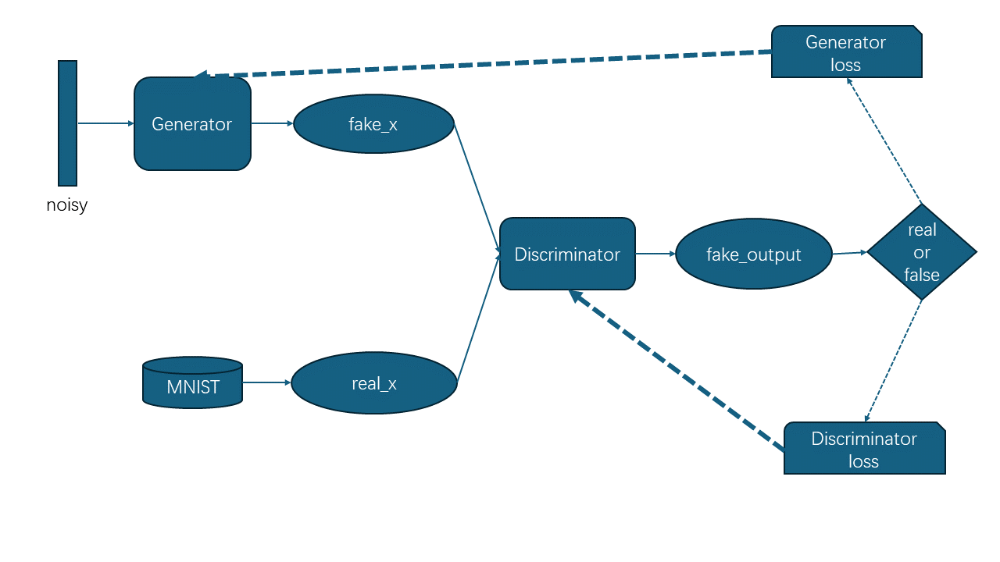
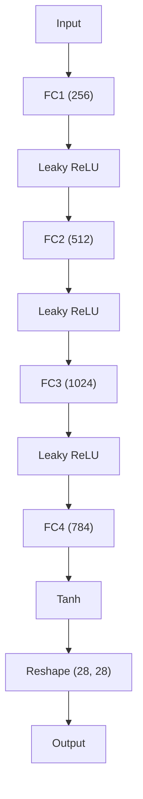
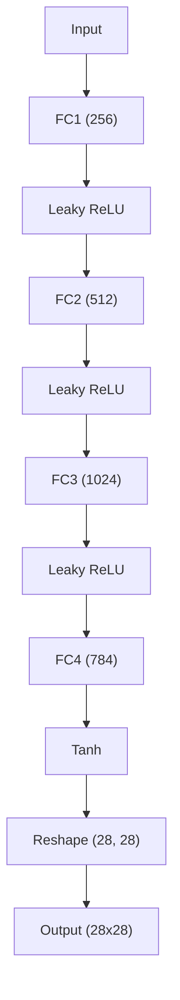
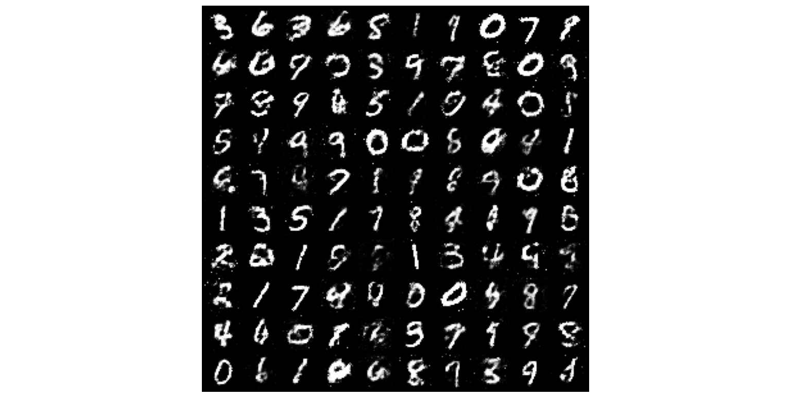
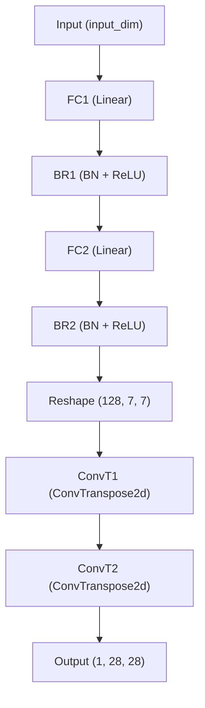
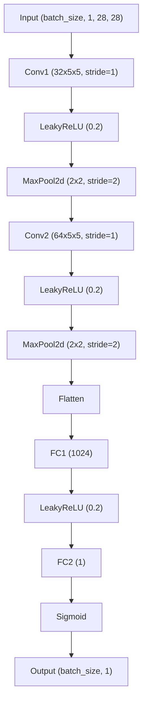

# GAN&DCGAN

# GAN与DCGAN模型

GAN/DCGAN模型主要由两个网络组成：生成器网络和判别器网络。**生成器**网络的任务是生成与训练数据相似的新样本，它从潜在空间（latent space，在这里我们采用随机高斯噪声）中随机采样作为输入，然后输出尽可能模仿训练集中真实样本的结果。**判别器**网络的任务则是尽量区分出生成器生成的样本和真实的训练数据。这两个网络在训练过程中通过相互对抗的方式不断提高性能，直到达到一个均衡和谐的状态。最后，我们就会得到一个质量较高的自动生成器和一个判断能力较强的分类器。​

## 训练过程

在这里，我们依旧采用自顶向下的学习方法。先不去考虑生成器模型（Generator）和判别器模型（Discriminator）的内部细节​

### 导包、定义超参数和加载MNIST数据集

```python
# 导入必要的包
import os
import torch
import torch.nn as nn
import torchvision

# 导入模型
from models.GAN import Generator, Discriminator

#定义超参数
device = torch.device('cuda:0' if torch.cuda.is_available() else 'cpu')

lr = 0.0002
num_epochs = 50
input_dim = 100
embed_dim = 64
batch_size = 64

# 加载MNIST数据集
transforms = torchvision.transforms.Compose([
        torchvision.transforms.ToTensor(),
        torchvision.transforms.Normalize([0.5], [0.5])
]) # 将图像缩放到[-1, 1]之间
train_dataset = torchvision.datasets.MNIST(root='./data', train=True, transform=torchvision.transforms.ToTensor(), download=True)
# 定义数据加载器
train_loader = torch.utils.data.DataLoader(dataset=train_dataset, batch_size=batch_size, shuffle=True, drop_last = True)
```

### 定义生成器和判别器，并定义损失函数和优化器

```python
# 定义模型
G = Generator(input_dim).to(device)
D = Discriminator().to(device)

# 定义损失函数和优化器
criterion = nn.BCELoss()

optim_G = torch.optim.Adam(G.parameters(), lr=lr)
optim_D = torch.optim.Adam(D.parameters(), lr=lr)
```

### 训练函数

通过训练函数我们可以很清晰的认识到GAN模型的训练过程

训练**判别器**过程 **：**

* **真实数据前向传播**：从真实数据集中采样一批数据`x`​，将其送入判别器`D`​得到输出`real_output`​
* **计算真实数据损失**：使用损失函数`criterion`​（在这里是二元交叉熵损失函数，真实标签为全1向量）计算`real_output`​与真实标签（全1的向量）之间的损失`real_loss`​
* **生成假数据**：从潜在空间中随机采样一批噪声数据，通过生成器`G`​生成假数据`fake_x`​。在更新判别器时，我们使用`.detach()`​来阻止梯度流到生成器
* **假数据前向传播**：将假数据`fake_x`​送入判别器`D`​得到输出`fake_output`​
* **计算假数据损失**：使用损失函数`criterion`​计算`fake_output`​与假标签（通常是全0的向量）之间的损失`fake_loss`​
* **计算判别器总损失**：将真实数据损失和假数据损失相加得到判别器的总损失`loss_D`​
* **反向传播和优化**：对`loss_D`​进行反向传播，并使用优化器`optim_D`​更新判别器的参数

由此，我们使判别器被训练为能够学会区分真实数据和假数据，从而指导生成器更好的生成数据。

训练**生成器**过程：

* **生成假数据**：再次从潜在空间（随机高斯分布）中随机采样一批噪声数据，通过生成器`G`​生成假数据`fake_x`​。这次不需要使用`.detach()`​，因为我们需要将梯度从判别器流回生成器
* **假数据前向传播**：将假数据`fake_x`​送入判别器`D`​得到输出`fake_output`​
* **计算生成器损失**：我们希望能够“欺骗”判别器将假数据误判为真数据，因此使用损失函数`criterion`​计算`fake_output`​与真实标签（全1的向量）之间的损失`loss_G`​
* **反向传播和优化**：对`loss_G`​进行反向传播，并使用优化器`optim_G`​更新生成器的参数

经过训练的生成器能够生成“比较真”的数据从而让瞒过判别器。最终，这两个网络通过相互竞争和对抗来不断提高自己的性能，最终形成一个均衡状态，即判别器无法准确区分真实数据和假数据而达到我们生成相似图像的目的。

```python
# 训练GAN函数
def train_GAN(x):
    '''判别器'''
    # 将真实数据移动到设备上
    real_x = x.to(device)

    # 更新判别器
    optim_D.zero_grad()
    real_output = D(real_x)
    real_loss = criterion(real_output, torch.ones_like(real_output).to(device))

    # 生成假数据，但更新判别器时不需要其梯度
	noise = torch.randn([batch_size, input_dim])
    fake_x = G(noise).to(device).detach()
    fake_output = D(fake_x)
    fake_loss = criterion(fake_output, torch.zeros_like(fake_output).to(device))

    loss_D = real_loss + fake_loss

    loss_D.backward()
    optim_D.step()

    '''生成器'''
    # 更新生成器
    optim_G.zero_grad()

    # 生成假数据并计算生成器的损失
    fake_x = G(torch.randn([batch_size, input_dim]).to(device))
    fake_output = D(fake_x)
    loss_G = criterion(fake_output, torch.ones_like(fake_output).to(device))

    loss_G.backward()
    optim_G.step()

    return loss_D.item(), loss_G.item()
```

### 训练并保存生成器模型

将训练得到的生成器模型权重保存到`save`​文件夹并命名为`Generator_GAN.pth`​供测试程序加载调用

```python
# 训练过程
print(device)
for epoch in range(num_epochs):
    loss_D, loss_G = 0, 0
    for i, (images, lables) in enumerate(train_loader):
        loss_D, loss_G = train_GAN(images)

        if (i+1) % 100 == 0:
            print('Epoch [{}/{}], Step [{}/{}], Loss_D: {:.4f}, Loss_G: {:.4f}'.format(epoch+1, 
                num_epochs, i+1, len(train_loader), loss_D, loss_G))

# 保存模型
current_dir = os.path.join(os.path.dirname(os.path.abspath(__file__)), 'save') + os.sep
torch.save(G.state_dict(), current_dir + 'Generator_GAN.pth')
```

经过整个训练过程，最终我们得到了一个生成器模型，这个模型能够生成与MNIST数据集相似的图像。

## 测试过程

在测试程序中，我们针对训练过程中得到的生成器来测试生成图像过程。具体来说，定义并加载生成器后，从潜在空间中采样一批随机向量输入生成器使其产生图像，并使用`matplotlib`​库中的函数将图像打印出来

### 导包、定义超参数和生成器模型

```python
mport os
import torch
import matplotlib.pyplot as plt

from models.GAN import Generator

# 定义超参数
input_dim = 100 # 随机向量长度
batch_size = 10

# 定义模型
G = Generator(input_dim)
G.eval()
```

### 加载模型参数

```python
# 加载训练好的模型参数
model_dir = os.path.join(os.path.dirname(os.path.abspath(__file__)), 'save', 'Generator_GAN.pth')
G.load_state_dict(torch.load(model_dir))
```

### 显示图像

```python
'''测试过程'''
noise = torch.randn(batch_size, input_dim)

images = G(noise).unsqueeze(1)
grid = make_grid(images, nrow=10, normalize=True)

# 展示图像
fig, ax = plt.subplots(figsize=(10,10))
ax.imshow(grid.permute(1, 2, 0).detach().cpu().numpy(), cmap='binary')
ax.axis('off')

plt.tight_layout() 
plt.show()  
```

运行测试程序就能以`10x10`​的网格展示生成的图像

## 模型实例

### GAN

GAN模型本身其实并不复杂，它的出现主要是提出一种生成式任务的新范式

**判别器**输入`[batch_size, w, h]`​大小的张量x（`fake_x`​或`real_x`​），最后每个输入图像属于某个类别的概率（如真实/生成）。判别器首先将图像展平通入全连接层，并使用`LeakReLU`​激活函数，最后使用`sigmiod`​函数输出概率值。网络架构大致如下



```python
#  辨别器,输入（1，28，28）
class Discriminator(nn.Module):
    def __init__(self, input_dim=28*28):
        super(Discriminator, self).__init__()
        self.fc1 = nn.Linear(input_dim, 1024)
        self.fc2 = nn.Linear(self.fc1.out_features, self.fc1.out_features//2)
        self.fc3 = nn.Linear(self.fc2.out_features, self.fc2.out_features//2)
        self.fc4 = nn.Linear(self.fc3.out_features, 1)
  
    def forward(self, x):
        x = x.view(-1, 28 *28)
        x = F.leaky_relu(self.fc1(x), 0.2)
        x = F.dropout(x, 0.3)
        x = F.leaky_relu(self.fc2(x), 0.2)
        x = F.dropout(x, 0.3)
        x = F.leaky_relu(self.fc3(x), 0.2)
        x = F.dropout(x, 0.3)
        output = torch.sigmoid(self.fc4(x))

        return output
```

**生成器**输入`[batch_size, input_dim]`​维度的随机向量，生成`[batch_size, w, h]`​大小的手写数字图像

生成器采用三层全连接和Tanh激活函数交替的网络架构



```python
# 生成器，输入100噪声输出（1，28，28）
class Generator(nn.Module):
    def __init__(self, input_dim, output_dim=28*28):
        super(Generator, self).__init__()   
        self.fc1 = nn.Linear(input_dim, 256)
        self.fc2 = nn.Linear(self.fc1.out_features, self.fc1.out_features*2)
        self.fc3 = nn.Linear(self.fc2.out_features, self.fc2.out_features*2)
        self.fc4 = nn.Linear(self.fc3.out_features, output_dim)
  
    def forward(self, x): 
        x = F.leaky_relu(self.fc1(x), 0.2)
        x = F.leaky_relu(self.fc2(x), 0.2)
        x = F.leaky_relu(self.fc3(x), 0.2)
        x = torch.tanh(self.fc4(x))
        output = x.view(-1, 28, 28)

        return output
```

下面是`num_epochs = 50`​、`lr = 0.0002`​训练之后的结果

​​

### DCGAN

DCGAN是在GAN的技术上引入深度神经网络来提高模型的表达能力和鉴别能力，其输入和输出结构与GAN保持一致，在此就不赘述了。

**生成器**使用`BN`​层，转置卷积层来优化网络



**判别器**使用大量卷积层和最大池化层来提取特征，网络结构如下



代码实现也很易懂

```python
import torch
import torch.nn as nn

# 生成器，输入100噪声输出（1，28，28）
class Generator(nn.Module):
    def __init__(self, input_dim):
        super(Generator, self).__init__()

        self.fc1 = nn.Linear(input_dim, 32 * 32)
        self.br1 = nn.Sequential(
            nn.BatchNorm1d(1024),
            nn.ReLU()
        )
        self.fc2 = nn.Linear(32 * 32, 128 * 7 * 7)
        self.br2 = nn.Sequential(
            nn.BatchNorm1d(128 * 7 * 7),
            nn.ReLU()
        )
        self.conv1 = nn.Sequential(
            nn.ConvTranspose2d(128, 64, 4, stride=2, padding=1),
            nn.BatchNorm2d(64),
            nn.ReLU()
        )
        self.conv2 = nn.Sequential(
            nn.ConvTranspose2d(64, 1, 4, stride=2, padding=1),
            nn.Sigmoid()
        )

    def forward(self, x):
        x = self.br1(self.fc1(x))
        x = self.br2(self.fc2(x))
        x = x.reshape(-1, 128, 7, 7)
        x = self.conv1(x)
        output = self.conv2(x)
    
        return output

#  辨别器,输入（1，28，28）
class Discriminator(nn.Module):
    def __init__(self):
        super(Discriminator, self).__init__()
    
        self.conv1 = nn.Sequential(
            nn.Conv2d(1, 32, 5, stride=1),
            nn.LeakyReLU(0.2)
        )
        self.pl1 = nn.MaxPool2d(2, stride=2)
        self.conv2 = nn.Sequential(
            nn.Conv2d(32, 64, 5, stride=1),
            nn.LeakyReLU(0.2)
        )
        self.pl2 = nn.MaxPool2d(2, stride=2)
        self.fc1 = nn.Sequential(
            nn.Linear(64 * 4 * 4, 1024),
            nn.LeakyReLU(0.2)
        )
        self.fc2 = nn.Sequential(
            nn.Linear(1024, 1),
            nn.Sigmoid()
        )

    def forward(self, x):
        x = self.conv1(x)
        x = self.pl1(x)
        x = self.conv2(x)
        x = self.pl2(x)
        x = x.view(x.shape[0], -1)
        x = self.fc1(x)
        output = self.fc2(x)

        return output
```

租的显卡到期了。。。就先不展示了

# 结语

GAN模型的应用场景非常广泛，并不限于图像生成任务，还可以用于图像编辑和风格转换，将一幅图像的风格转换成另一种风格，例如将日常照片转换成梵高或毕加索的画风。DCGAN在GAN的基础上引入深度学习的部分概念来提高模型能力。但GAN模型也存在一些缺点，如训练不稳定、梯度消失和模式崩溃等问题，毕竟要同时训练两个模型使其达到平衡点这件事本身就很复杂。

# 参考&致谢

* [GAN实践：MNIST手写数字生成](https://zhuanlan.zhihu.com/p/366926565)：知乎大佬的分享
* [pytorch-mnist-GAN](https://github.com/lyeoni/pytorch-mnist-GAN)：GAN网络结构参考自Github大佬
* [基于生层对抗网络（GAN）在MNIST手写数字数据集上生成假图片（pytorch版）](http://zuzhiang.cn/2020/02/21/GAN-example/)：DCGAN的代码参考自大佬的博客

‍
