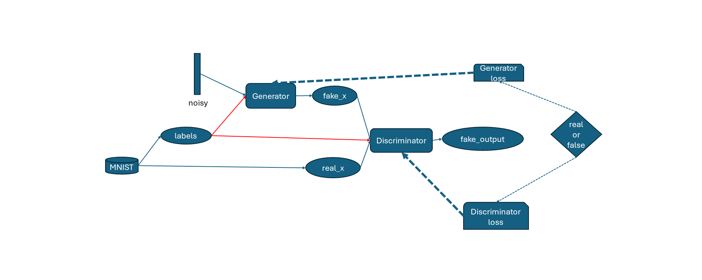
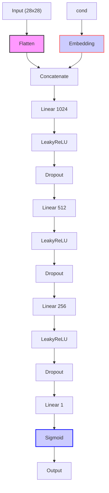
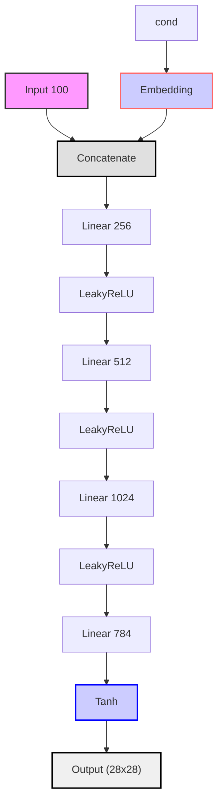
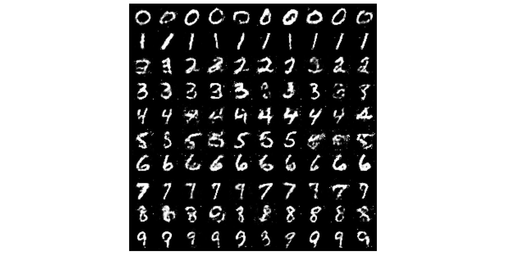

# cGAN

# conditionGAN模型

在上文提到的GAN（以及DCGAN）中，生成器和判别器只处理随机噪声作为输入，生成器试图从噪声中生成逼真的样本，而判别器则试图区分这些生成的样本和真实的样本。然而，在cGAN中，生成器除了接收随机噪声输入外，还接收一个条件（condition）作为输入。这个条件可以是任何有意义的信息，比如类别标签、图像描述等。这使得cGAN可以生成**特定条件下**的样本，提供更加精确和可控的生成能力，使得模型可以更好被应用。相比于GAN，cGAN的生成器和判别器在训练时还会将`labels`​作为条件输入以此来生成符合特定条件的样本

## 训练过程train_cGAN.py

从整体来看，cGAN和GAN的框架结构基本一致，只是多了`labels`​的输入​

### 导包，超参，加载数据集和迭代器，定义模型和损失函数

```python
import os
import torch
import torch.nn as nn
import torchvision

from models.cGAN import Generator, Discriminator

#定义超参数
device = torch.device('cuda:0' if torch.cuda.is_available() else 'cpu')

lr = 1e-4
num_epochs = 50
input_dim = 100
embed_dim = 10 # 通过嵌入层后的维度
batch_size = 64

# 加载MNIST数据集
transform = torchvision.transforms.Compose([
        torchvision.transforms.ToTensor(),
        torchvision.transforms.Normalize([0.5], [0.5])
]) # 将图像缩放到[-1, 1]之间
train_dataset = torchvision.datasets.MNIST(root='./data', train=True, transform=transform, download=True)

# 定义数据加载器
train_loader = torch.utils.data.DataLoader(dataset=train_dataset, batch_size=batch_size, shuffle=True, drop_last=True)

# 定义模型
G = Generator(input_dim=input_dim, embed_dim=embed_dim).to(device)
D = Discriminator(embed_dim=embed_dim).to(device)

# 定义损失函数和优化器
criterion = nn.BCELoss()

optim_G = torch.optim.Adam(G.parameters(), lr=lr)
optim_D = torch.optim.Adam(D.parameters(), lr=lr)
```

### 训练函数

```python
'''训练cGAN'''
def train_cGAN(x, conditions):  
    # 将真实数据和条件移动到适当的设备（如GPU）  
    real_x = x.to(device)  
    real_conditions = conditions.to(device)  
  
    # 清零判别器的梯度  
    optim_D.zero_grad()  
  
    # 计算判别器对真实数据的损失  
    real_output = D(real_x, real_conditions)  
    real_loss = criterion(real_output, torch.ones_like(real_output))  
  
    # 生成假数据  
    fake_conditions = real_conditions.detach()
    noise = torch.randn([batch_size, input_dim]).to(device)  
    fake_x = G(noise, fake_conditions)  
  
    # 计算判别器对假数据的损失  
    fake_output = D(fake_x.detach(), fake_conditions)  # .detach()是为了在反向传播时不更新生成器  
    fake_loss = criterion(fake_output, torch.zeros_like(fake_output))  
  
    # 判别器的总损失  
    loss_D = real_loss + fake_loss  
  
    # 反向传播并更新判别器的权重  
    loss_D.backward()  
    optim_D.step()  
  
    # 清零生成器的梯度  
    optim_G.zero_grad()  
  
    # 生成器希望判别器将假数据判断为真  
    fake_output = D(fake_x, fake_conditions)  # 这次不需要.detach()，因为我们要更新生成器  
    loss_G = criterion(fake_output, torch.ones_like(fake_output))  
  
    # 反向传播并更新生成器的权重  
    loss_G.backward()  
    optim_G.step()  
  
    return loss_D.item(), loss_G.item()  # 返回损失值而不是tensor
```

训练函数输入图像数据`x`​和`conditions`​作为参数,其余和GAN的训练函数基本一致，只不过判别器和生成器输入多考虑了标签作为条件。下面***加重斜体字样***为与GAN的区别

训练**判别器**过程 **：**

* **真实数据前向传播**：从真实数据集中采样一批数据`x`​***和***​***​`real_conditions`​***，将其送入判别器`D`​得到输出`real_output`​
* **计算真实数据损失**：使用损失函数`criterion`​（在这里是二元交叉熵损失函数，真实标签为全1向量）计算`real_output`​与真实标签（全1的向量）之间的损失`real_loss`​
* **生成假数据**：从潜在空间中随机采样一批噪声数据***和***​***​`real_conditions`​***​，通过生成器`G`​生成假数据`fake_x`​。在更新判别器时，我们使用`.detach()`​来阻止梯度流到生成器
* **假数据前向传播**：将假数据`fake_x`​***和***​***​`real_conditions`​***​条件送入判别器`D`​得到输出`fake_output`​
* **计算假数据损失**：使用损失函数`criterion`​计算`fake_output`​与假标签（通常是全0的向量）之间的损失`fake_loss`​
* **计算判别器总损失**：将真实数据损失和假数据损失相加得到判别器的总损失`loss_D`​
* **反向传播和优化**：对`loss_D`​进行反向传播，并使用优化器`optim_D`​更新判别器的参数

训练**生成器**过程：

* **生成假数据**：再次从潜在空间（随机高斯分布）中随机采样一批噪声数据***和标签***，通过生成器`G`​生成假数据`fake_x`​。这次不需要使用`.detach()`​，因为我们需要将梯度从判别器流回生成器
* **假数据前向传播**：将假数据`fake_x`​***和***​***​`fake_conditions`​***送入判别器`D`​得到输出`fake_output`​
* **计算生成器损失**：我们希望能够“欺骗”判别器将假数据误判为真数据，因此使用损失函数`criterion`​计算`fake_output`​与真实标签（全1的向量）之间的损失`loss_G`​
* **反向传播和优化**：对`loss_G`​进行反向传播，并使用优化器`optim_G`​更新生成器的参数

### 训练并保存

```python
# 训练过程
print(device)
for epoch in range(num_epochs):
    loss_D, loss_G = 0, 0
    for i, (images, lables) in enumerate(train_loader):
        loss_D, loss_G = train_cGAN(images, lables)

        if (i+1) % 100 == 0:
            print('Epoch [{}/{}], Step [{}/{}], Loss_D: {:.4f}, Loss_G: {:.4f}'.format(epoch+1, 
                num_epochs, i+1, len(train_loader), loss_D, loss_G))

# 保存模型
current_dir = os.path.join(os.path.dirname(os.path.abspath(__file__)), 'save') + os.sep
torch.save(G.state_dict(), current_dir + 'Generator_cGAN.pth')
```

我们将训练得到的生成器模型权重保存在`save`​文件夹内并命名为`Generator_cGAN.pth`​

## 测试过程test_cGAN.py

我们将随机噪声和标签从0到9分别输入生成器以期望生成理想的手写数字，其中每个标签生成十张图片供查看

```python
import os
import torch
import matplotlib.pyplot as plt
from torchvision.utils import make_grid

from models.cGAN import Generator

# 定义超参数
input_dim = 100
embed_dim = 64

# 定义模型
G = Generator(input_dim, embed_dim)
G.eval()

# 加载模型参数
model_dir = os.path.join(os.path.dirname(os.path.abspath(__file__)), 'save', 'Generator_cGAN.pth')
G.load_state_dict(torch.load(model_dir)) 

'''测试过程'''
noise = torch.randn(100, 100)
labels = torch.Tensor([i for i in range(10) for _ in range(10)])

images = G(noise, labels).unsqueeze(1)
grid = make_grid(images, nrow=10, normalize=True) # images范围: [-1, 1] -> [0, 1]

# 展示图像
fig, ax = plt.subplots(figsize=(10,10))
ax.imshow(grid.permute(1, 2, 0).detach().cpu().numpy(), cmap='binary')
ax.axis('off')

plt.tight_layout() 
plt.show()
```

## 模型实例

**嵌入层**主要用于将条件信息（如类别标签、文本描述等）转换为向量表示，以便模型能够处理并理解这些数据。在cGAN中，嵌入层的作用类似于自然语言处理任务中的嵌入层，它将每个条件信息映射到一个向量表示，从而帮助模型理解条件信息之间的语义关系。这些向量表示随后被用作生成器和判别器的输入，以影响生成样本的属性和质量。当然，我们这里的条件数据仅仅是0-9的标签值，所以只是简单的调用pytorch内置的嵌入层来向量化条件。如果考虑“用一段话控制生成器的输出”这种复杂的任务就要好好设计一下嵌入层的结构了

```python
# 嵌入层
# 将标签数据转化为embedding_dim长度的向量供使用
class Embedding(nn.Module):
    def __init__(self, num_embedding, embedding_dim):
        super().__init__()

        self.embed = nn.Embedding(num_embeddings=num_embedding,
                                  embedding_dim=embedding_dim)

    def forward(self, x):
        output = self.embed(x)

        return output
```

**判别器**使用全连接层和`LeakyReLU`​激活函数，并引入`dropout层`​来正则化。28*28大小的图像首先被展平，而条件数据进入嵌入层被向量化后与图像数据**拼接**在一起进入神经网络，最后通过`sigmiod`​函数输出概率值



```python
class Discriminator(nn.Module):
    def __init__(self, embed_dim):
        super().__init__()
    
        self.embed_dim = embed_dim
        self.embed = Embedding(num_embedding=10,
                                embedding_dim=self.embed_dim)
    
        self.model = nn.Sequential(
            nn.Linear(in_features=28 * 28 + embed_dim, out_features=1024),
            nn.LeakyReLU(negative_slope=0.2, inplace=True),
            nn.Dropout(0.3),
            nn.Linear(1024, 512),
            nn.LeakyReLU(0.2, inplace=True),
            nn.Dropout(0.3),
            nn.Linear(512, 256),
            nn.LeakyReLU(0.2, inplace=True),
            nn.Dropout(0.3),
            nn.Linear(256, 1),
            nn.Sigmoid()
        )
  
    def forward(self, x, cond):
        x = x.view(x.size(0), -1) # x.size(0) = batch_size
        c = self.embed(cond)
        x = torch.cat([x, c], dim=1)
        out = self.model(x)

        return out.squeeze()
```

相似的，**生成器**的结构也设置的很简单，输入100维的随机噪声和向量化后的条件数据，拼接后进入生成器网络，最后输出28*28的图像数据



```python
class Generator(nn.Module):
    def __init__(self, input_dim, embed_dim):
        super().__init__()
      
        self.input_dim = input_dim
        self.embed_dim = embed_dim
        self.embed = Embedding(num_embedding=10, 
                                   embedding_dim=self.embed_dim)
      
        self.model = nn.Sequential(
            nn.Linear(in_features=self.input_dim + self.embed_dim,
                       out_features=256),
            nn.LeakyReLU(negative_slope=0.2, inplace=True),
            nn.Linear(256, 512),
            nn.LeakyReLU(0.2, inplace=True),
            nn.Linear(512, 1024),
            nn.LeakyReLU(0.2, inplace=True),
            nn.Linear(1024, 784),
            nn.Tanh()
        )
  
    def forward(self, x, cond):
        x = x.view(x.size(0), self.input_dim)
        c = self.embed(cond)
        x = torch.cat([x, c], 1)

        output = self.model(x)
      
        return output.view(x.size(0), 28, 28)
```

下面是`num_epochs = 50`​、`lr = 0.0001`​训练之后的结果。可以看到的是，与GAN随机生成的图像不同，cGAN在条件的控制下生成了有序的数字。

​​

# 结语

cGAN通过引入条件变量，为生成特定内容提供了强大的控制力。然而，与GAN一样，cGAN也面临着训练稳定性和模式崩溃的挑战。为此，我们可以使用cDCGAN，它结合了cGAN的条件控制和DCGAN（上篇介绍）的卷积神经网络架构，旨在提高模型的稳定性和生成图像的质量。此外，cDiffusion模型则融合了cGAN的条件控制和Diffusion模型（下篇介绍）的逐步去噪思想，为生成模型带来了新的发展方向。这些优化策略有望进一步提升cGAN的性能和实用性。

# 致谢&参考

* [Pytorch Conditional GAN](https://github.com/arturml/mnist-cgan)：网络结构参考自大佬的github
