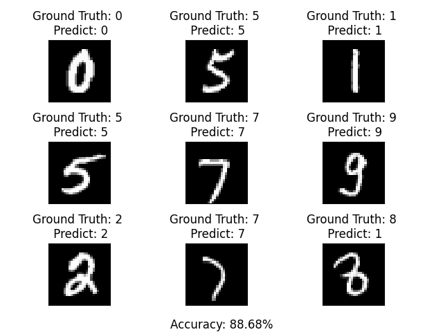
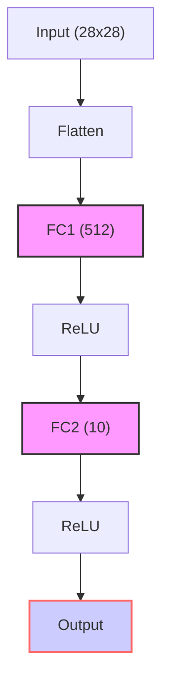
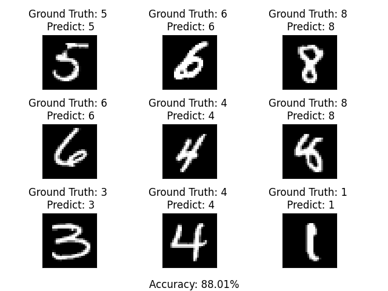
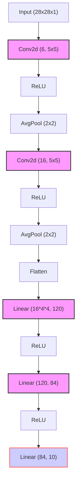
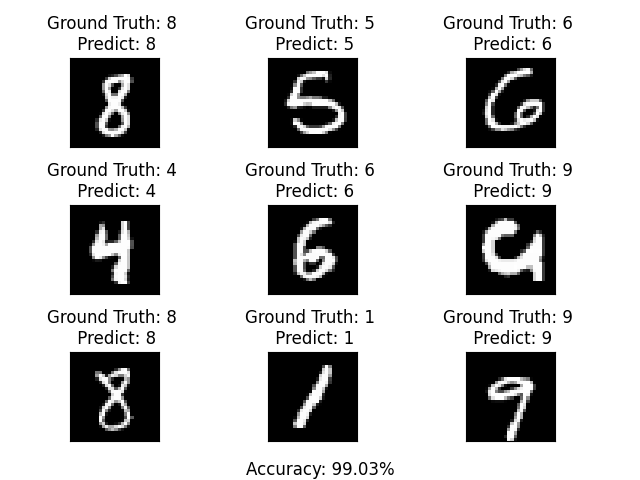
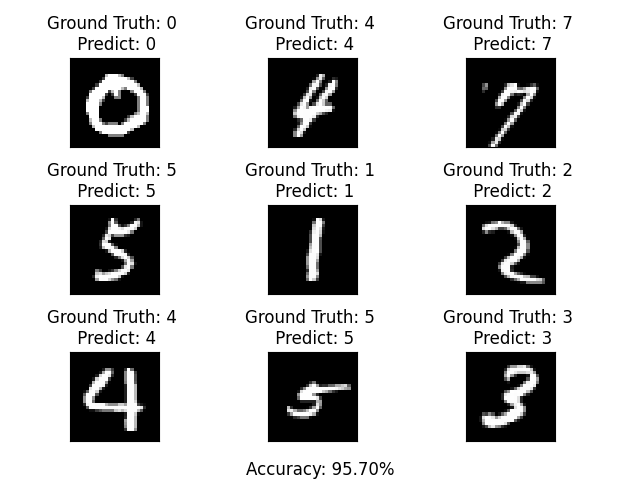
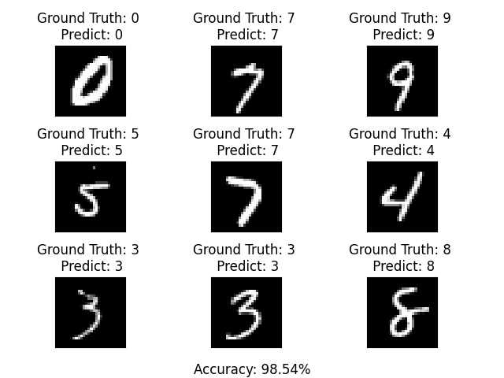
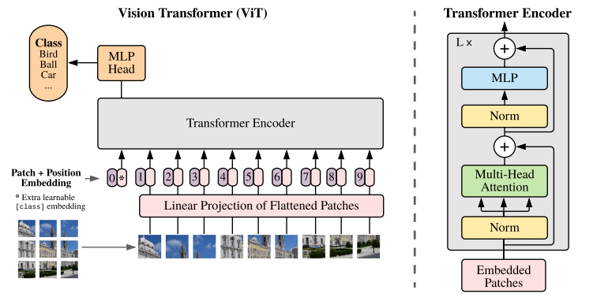

# MNIST手写数字识别

> 本文全部代码位于 [GitHub 仓库](https://github.com/ji2814/hello-MNIST)中的 Recognize 目录中

# 介绍

**[MNIST](http://yann.lecun.com/exdb/mnist/)**​ **（Modified National Institute of Standards and Technology）数据集** 是一个大型的手写数字数据库，包含 60,000 个训练样本和 10,000 个测试样本，每个样本都是 28x28 像素的图像，代表一个 0~9 之间的手写数字。对于深度学习初学者来说，MNIST 数据集是每个人都绕不开的启蒙之作，几乎所有的教程都会使用这个数据集来作为演示，可以称得上是深度学习界的 `hello,world!`​ 了。

在我的理解中，深度学习主要包括**判别式任务**和**生成式任务**，分别对应判别式模型和生成式模型。

判别式任务是指那些需要模型根据输入数据进行分类或回归的任务。如图像分类、文本分类、语音识别等都属于判别式任务。在这类任务中，模型通过学习输入数据和标签之间的关系，试图找到一个合适的函数或概率分布来预测给定测试数据的标签。在本文我们主要关注判别式任务，通过架构不同的模型来完成手写数字识别的任务。

# 训练过程

简而言之，深度学习就是让**模型**通过大量阅读数据与标签之间的对应关系，在损失函数的指导下学习到任务目标。我习惯把训练过程理解为通过不断地 `考试(预测)-判分(损失)-修订(优化)`​ 来学习知识。

首先我们导入必要的包

```python
import os
import torch
import torchvision
import matplotlib.pyplot as plt
```

之后导入必要的模型

```python
from models.MLP import MLP
```

定义所需要的超参数

```python
#定义超参数
device = torch.device('cuda:0' if torch.cuda.is_available() else 'cpu')

num_epochs = 50
lr = 0.09
batch_size = 64
```

加载所需要的数据，由于`torchvision`​中自带 MNIST 数据集，我们可以直接使用

```python
# 加载MNIST数据集训练部分
transforms = torchvision.transforms.Compose([
        torchvision.transforms.ToTensor(),
        torchvision.transforms.Normalize([0.5], [0.5])
]) # 将图像缩放到[-1, 1]之间
test_dataset = torchvision.datasets.MNIST(root='./data', train=True, transform=transforms)

# 定义数据加载器
test_loader = torch.utils.data.DataLoader(dataset=test_dataset, batch_size=64, shuffle=True)
```

接下来就是定义模型

```python
net = MLP() # 在这里以MLP模型为例
net = net.to(device)
```

使用交叉熵损失函数来完成分类问题，优化器采用更加平滑的 Adam 方法

```python
# 定义损失函数和优化器
criterion = nn.CrossEntropyLoss()
optimizer = torch.optim.Adam(net.parameters())
```

得益于pytorch 框架的良好封装，使得我们很容易实现训练函数。将原始数据图像`images`​通过模型`net`​得到预测值`outputs`​，针对`outputs`​和真实标签`lables`​的损失差距来进行优化。

```python
# 训练函数
def train(images, lables):
        images = images.to(device)
        lables = lables.to(device)

        optimizer.zero_grad()

        outputs = net(images)
        loss = criterion(outputs, lables)
        loss.backward()
        optimizer.step()

        return loss
```

训练过程就是不断地调用上面的训练函数，并打印损失值

```python
# 训练过程
print(device)
for epoch in range(num_epochs):
    for i, (images, lables) in enumerate(train_loader):

        loss = train(images, lables)
      
        if (i+1) % 100 == 0:
            print('Epoch [{}/{}], Step [{}/{}], Loss: {:.4f}'.format(epoch+1, num_epochs, i+1, len(train_loader), loss.item()))
```

最后我们将训练好的模型保存到 `save` ​文件夹内，并命名为 `{模型名称}.pth` ​供测试或者部署使用

```python
# 保存模型
current_dir = os.path.join(os.path.dirname(os.path.abspath(__file__)), 'save') + os.sep
torch.save(net.state_dict(), current_dir + net._get_name() + '.pth')
```

以上，我们就完成了从加载数据集、定义模型、训练并保存模型的过程。

# 测试过程

如果说训练是一个平时月考过程，那么测试就是最终的高考，给模型输入一张图片，让其通过之前学习到的知识来完成判别任务，并测试正确率指标。

与训练过程类似，我们通过导入 pytorch 并加载相对应的模型和数据集。只不过在加载数据集时将 `train` ​参数设置为 `False` ​表明使用与训练集不相交的测试集

```python
import os
import torch
import torchvision
import matplotlib.pyplot as plt

from models.MLP import MLP

# 加载MNIST数据集
transforms = torchvision.transforms.Compose([
        torchvision.transforms.ToTensor(),
        torchvision.transforms.Normalize([0.5], [0.5])
]) # 将图像缩放到[-1, 1]之间
test_dataset = torchvision.datasets.MNIST(root='./data', train=False, transform=transforms)

# 定义数据加载器
test_loader = torch.utils.data.DataLoader(dataset=test_dataset, batch_size=64, shuffle=True)
```

之后定义模型并在加载训练过程保存的模型参数

```python
# 定义模型
net = MLP()

# 加载模型参数
model_dir = os.path.join(os.path.dirname(os.path.abspath(__file__)), 'save', net._get_name() + '.pth')
net.load_state_dict(torch.load(model_dir))
```

接下来就是对于测试集中的每张图片都进行 `预测-判断`​ 过程来测试模型正确率

```python
# 计算模型准确率
net.eval()
with torch.no_grad():
    correct = 0
    total = 0
    for image, label in test_loader:
        outputs = net(image)
        _, predicted = torch.max(outputs.data, 1)
        total += label.size(0)
        correct += (predicted == label).sum().item()

    accuracy = 100 * correct / total
    print('Test Accuracy: {:.2f}%'.format(accuracy))
```

在最后，我们也可以把测试图片和其对应的预测标签打印出来主观评测一下

```python
# 加载测试集
examples = enumerate(test_loader)
_, (example_images, example_targets) = next(examples)

# 显示图片
fig = plt.figure()
for i in range(9):
    plt.subplot(3,3,i+1)
    plt.tight_layout()
    plt.imshow(example_images[i][0], cmap='gray', interpolation='none')

    example_outputs = net(example_images)
    _, example_predicts = torch.max(example_outputs.data, dim=1)
  
    plt.title("Ground Truth: {} \n Predict: {}".format(example_targets[i], example_predicts[i]))

    '''移除刻度'''
    plt.xticks([])
    plt.yticks([])

# 在底部显示准确率
accuracy_text = "Accuracy: {:.2f}%".format(accuracy)
plt.figtext(0.5, 0.01, accuracy_text, ha='center', fontsize=12)

plt.show()
```

下面是一个示例​

# 模型实例

自人工智能这一命题被提出以来，先是机器学习的一些经典方法被用来作为模型的核心算法来完成分类或回归任务。随着计算能力的飞跃和内存容量的平民化，深度学习相关研究百花齐放，包括多层感知机、卷积、循环神经网络的出现和残差、transform 结构的提出，大大丰富了我们对于模型的选择。

## 多层感知机 MLP

高中时期我们就被告知可以用 `y=Wx+b`​ 这个线性函数来拟合数据分布，但线性这个特征太过想当然，在真实的现实世界充斥着大量的非线性特征。于是，研究者们从生物学领域获得灵感，提出了**神经元**的概念，并引入**激活函数**来使模型获得更强的表征能力。

多层感知机 MLP 使用多层神经网络和激活函数来构造模型，在这里我们仅仅构造两层网络并使用 ReLU 激活函数。下面是网络结构示例



```python
# 导入必要的包
import torch
import torch.nn as nn

class MLP(nn.Module):
    def __init__(self):
        super(MLP, self).__init__()

        self.fc1 = nn.Linear(in_features=28 * 28, out_features=512)
        self.fc2 = nn.Linear(in_features=512, out_features=10)

    def forward(self, x):
		# MNIST中每一张图片为28*28大小的矩阵
        x = x.view(-1, 28 * 28) # 将二维矩阵平铺
        x = torch.relu(self.fc1(x))
        output = torch.relu(self.fc2(x))

        return output

```

下面是`num_epochs = 50`​、`lr = 0.09`​训练之后的结果

​​

## 引入卷积层的 LeNet5

使用多层神经网络固然能够使模型获得学习的能力，但其所需要的参数量太大和计算复杂度太高一直是被诟病的问题。于是，卷积层应运而生，通过引入**感受野**的概念来使模型获得提取特征的能力，在减少参数量和计算量的同时能够提高模型的泛化能力。如果把网络做的更深，甚至能够兼顾局部和全部特征的提取。

而 LeNet 模型作为深度学习网络的开山之作，通过卷积和池化操作逐渐抽取图像的特征信息，最后使用全连接层进行分类操作。它在手写数字识别任务中取得了很好的效果，并为后续的深度学习模型提供了重要的启示和参考。

LeNet5 的结构如下所示​



```python
# 导包
# LeNet-5模型
class LeNet5(nn.Module):
    def __init__(self):
        super(LeNet5, self).__init__()

        self.convBlock = nn.Sequential(
            nn.Conv2d(in_channels=1, out_channels=6, kernel_size=5, stride=1),
            nn.ReLU(),
            nn.AvgPool2d(kernel_size=2, stride=2),
            nn.Conv2d(in_channels=6, out_channels=16, kernel_size=5, stride=1),
            nn.ReLU(),
            nn.AvgPool2d(kernel_size=2, stride=2)
        )

        self.fcBlock = nn.Sequential(
            nn.Linear(in_features=16 * 4 * 4, out_features=120),
            nn.ReLU(),
            nn.Linear(in_features=120, out_features=84),
            nn.ReLU(),
            nn.Linear(in_features=84, out_features=10)
        )

    def forward(self, x):
        x = self.convBlock(x)
        x = x.view(-1, 16 * 4 * 4)
        output = self.fcBlock(x)
  
        return output
```

下面是`num_epochs = 50`​、`lr = 0.05`​训练之后的结果

​​

## 残差神经网络 ResNet

为了解决多层神经网络训练过程中的梯度消失/爆炸的问题，何凯明等大佬创世纪的提出了残差结构。具体来说，残差结构通过引入跳跃连接（Skip Connection），使得网络中的信息可以直接绕过一些层进行传递，从而增强了网络的表达能力。不仅如此，ResNet 还通过使用批归一化（Batch Normalization）等技术来加速训练过程和提高模型性能。

ResNet 的出现对深度神经网络来说具有重大的历史意义。它不仅在图像识别任务中取得了显著的性能提升，还在其他计算机视觉任务（如目标检测、图像分割等）中得到了广泛应用。此外，ResNet 的思想也被应用于其他深度学习领域。

​")​

```python
# 导包

# ResNet模型
class ResNet(nn.Module):
    def __init__(self, useConv=False):
        super(ResNet, self).__init__()

        self.conv1 = nn.Conv2d(in_channels=1, out_channels=8, kernel_size=3, stride=1, padding=1)
        self.bn1 = nn.BatchNorm2d(num_features=8)
        self.conv2 = nn.Conv2d(in_channels=8, out_channels=8, kernel_size=3, stride=1, padding=1)
        self.bn2 = nn.BatchNorm2d(num_features=8)

		# 使用useConv参数来控制残差连接时是否使用卷积层
        if useConv:
            self.conv3 = nn.Conv2d(in_channels=1, out_channels=8, kernel_size=1, stride=1)
        else:
            self.conv3 = None

        self.conv4 = nn.Conv2d(in_channels=8, out_channels=1, kernel_size=1, stride=1)

        self.fc = nn.Linear(in_features=28 * 28, out_features=10)

    def forward(self, X):
        Y =self.bn1(self.conv1(X))
        Y = torch.relu(Y)

        Y = self.bn2(self.conv2(Y))

        if self.conv3:
            X = self.conv3(X)

        Y += X # 残差连接
        Y = self.conv4(Y)
        Y = Y.view(-1, 28 * 28)
        output = self.fc(Y) # 最后使用全连接层分类

        return output
```

下面是`num_epochs = 30`​、`lr = 0.05`​训练之后的结果

​​

## 引入循环层的 GRU​​

循环神经网络（RNN）则主要用于处理序列数据，如自然语言处理、时间序列预测等。RNN 的特点是具有记忆功能，可以捕捉数据中的时间依赖关系。虽说循环神经网络包括其变体 GRU 和 LSTM 等主要被用来处理时间或者语言这种和序列相关的任务，但也可以将二维图片数据 `长*宽`​ 看作 `时间序列*表示向量`​ 来了解使用 GNN，将图像的每一行或每一列视为一个序列，并将像素值作为序列中的元素就可以使用 RNN 对这个序列进行建模和分类。

GRU（Gated Recurrent Unit）模型是一种循环神经网络（RNN）的变体，它有效地解决了传统 RNN 在处理长序列时遇到的梯度消失或梯度爆炸问题。同时相较于 LSTM 结构更加简单，能够有效的降低计算复杂度。

GRU 模型的核心结构包括两个门控机制：更新门（Update Gate）和重置门（Reset Gate）。这两个门控机制分别用于控制信息的更新和重置。在每一步中，GRU 首先根据当前的输入和上一步的隐藏状态计算这两个门的值。然后，使用重置门来控制从上一步隐藏状态中保留多少信息，并将其与当前输入结合，生成候选隐藏状态。接着，使用更新门来控制从候选隐藏状态中保留多少信息，并将其与上一步的隐藏状态结合，生成新的隐藏状态。在 pytorch 中我们可以直接使用 `nn.GRU()` ​模块来直接调用该结构。

​")​

```python
# 导包
# GRU
class GRU(nn.Module):
    def __init__(self):
        super(GRU, self).__init__()

		# 直接调包
        self.gru = nn.GRU(input_size=28, hidden_size=64, batch_first=True)
        self.fc = nn.Linear(in_features=64, out_features=10)

    def forward(self, X):
        X = X.view(-1, 28, 28)
        Y, _ = self.gru(X, None) # 只通过一层GRU

        Y = Y[:, -1, :] # 获得最后一个时间序列的输出
        output = self.fc(Y)

        return output
```

下面是`num_epochs = 30`​、`lr = 0.05`​训练之后的结果​

## 引入 Transformer 的 ViT

Transformer 模型是一种基于注意力机制的深度学习模型，被广泛应用于自然语言处理（NLP）任务。该模型仅依靠注意力机制来完成**编码-解码**过程，从而实现了并行计算，提高了训练速度。Transformer 模型提出的自注意力机制和多头注意力机制允许模型在处理序列中的每个元素时，能够对序列中的其他元素进行加权关注，从而捕获元素直接相互依赖关系，获取更丰富的上下文信息。不仅如此，Transformer 模型还包括位置编码、前馈神经网络、残差连接和层归一化等结构使其表达能力更强。")​

ViT(Vision Transformer)模型是一种基于 Transformer 架构的视觉处理模型，其核心思想是将图像视为一系列的图像块（或称为图像补丁），并将这些图像块作为序列输入到 Transformer 模型中。通过这种方式，ViT 模型能够利用 Transformer 的自注意力机制来捕捉图像中的长时间依赖关系，从而在处理图像的全局信息时表现出色。​

ViT 模型仅使用 Transformer 的编码器部分来提取图像中的特征，使用一个 MLP 来作为解码器作分类。从代码来说，ViT 模型主要分为

* 基本块：依次为 `Norm`​ 层、多头注意力层、残差连接、`Norm`​ 层和最后的 `MLP`​ 层
* 编码器：核心组件。首先将输入的图像分为` patches`​ 并嵌入成向量、添加位置编码并将其与代表图像 `patch`​ 的嵌入向量相加，之后添加分类 `token`​(以匹配 batch 大小)传递给 `depth`​层的 `Transformer`​ 基本块，最后从 `Transformer`​ 的输出中提取分类 `token`​（即第一个 token），并将其作为编码器的输出。
* 解码器：使用一个 MLP 输出类别数以适配多分类任务
* ViT 模型：将编码器-解码器结构组合起来

```python
# 导包

# Transformer基本块
class TransformerBlock(nn.Module):  
    def __init__(self, dim, heads, mlp_dim):  
        super().__init__()  

        self.norm1 = nn.LayerNorm(dim)  
        self.attn = nn.MultiheadAttention(dim, heads)  
        self.norm2 = nn.LayerNorm(dim)  
        self.mlp = nn.Sequential(  
            nn.Linear(dim, mlp_dim),  
            nn.GELU(),  
            nn.Linear(mlp_dim, dim), 
        )  

    def forward(self, x, mask=None):  
        x = x + self.attn(self.norm1(x), self.norm1(x), self.norm1(x), attn_mask=mask)[0]  
        x = x + self.mlp(self.norm2(x))  
    
        return x  


# 编码器
class Encoder(nn.Module):
    def __init__(self, image_size, patch_size, dim, depth, heads, mlp_dim, channels):  
        super().__init__()  

        assert image_size % patch_size == 0, 'Image dimensions must be divisible by the patch size.'  
        num_patches = (image_size // patch_size) ** 2  
        patch_dim = channels * patch_size ** 2  
  
		# 使用CNN来嵌入
        self.to_patch_embedding = nn.Sequential(  
            nn.Conv2d(in_channels=channels, out_channels=dim, kernel_size=patch_size, stride=patch_size),  
            nn.Flatten(2)
        )  
 
		#添加分类token
        self.cls_token = nn.Parameter(torch.randn(1, 1, dim))  
		# 位置编码层
        self.pos_embedding = nn.Parameter(torch.randn(1, num_patches + 1, dim))  
  
		# depth层基本块
        self.transformer = nn.Sequential(*[TransformerBlock(dim, heads, mlp_dim) for _ in range(depth)])  
  
        self.to_cls_token = nn.Identity()  
  
    def forward(self, x):
        x = self.to_patch_embedding(x) 
        x = x.transpose(1, 2) # 交换维度，以便与匹配Transformer维度
        b, n, _ = x.shape  
        cls_tokens = self.cls_token.expand(b, -1, -1)  
        x = torch.cat((cls_tokens, x), dim=1) # 将token与原始输入拼接
        x += self.pos_embedding # 添加位置编码

        x = self.transformer(x)  # 通过多层transformer基本块
        output = self.to_cls_token(x[:, 0]) # 取最后一个token

        return output


# 解码器结构
class Decoder(nn.Module):
    def __init__(self, dim, num_classes):
        super().__init__()

        self.mlp_head = nn.Sequential(
            nn.Linear(in_features=dim, out_features=num_classes)
        )

    def forward(self, x):
        output = self.mlp_head(x)

        return output


# ViT模型
class ViT(nn.Module):  
    def __init__(self, image_size=28, patch_size=4, num_classes=10, 
                    dim=64, depth=4, heads=8, mlp_dim=128, channels=1):  
        super().__init__()  
  
        self.encoder = Encoder(image_size, patch_size, dim, depth, heads, mlp_dim, channels)
        self.decoder = Decoder(dim, num_classes)

    def forward(self, img):
        x = self.encoder(img)
        output = self.decoder(x)

        return output 
```

下面是`num_epochs = 20`​、`lr = 0.05`​训练之后的结果

TODO

# 结语

以上，我们就完成了 MNIST 数据集中关于判别式任务的部分模型。当然，深度学习模型浩如烟海，本文不可能穷尽所有。写这篇文章的目的本就是在我学习 `深度学习入门`​ 各种课程时的记录和整理，对于我自己来说，也算是完成任务了。

# 参考&致谢

* [Dive into Deep Learning](https://d2l.ai/)：深度学习启蒙之作
* [文心一言](https://yiyan.baidu.com/)：AI 万岁！！
* [真香！Vision Transformer 快速实现 Mnist 识别](https://zhuanlan.zhihu.com/p/486360853)：大佬关于 ViT 的介绍和代码实现

‍
